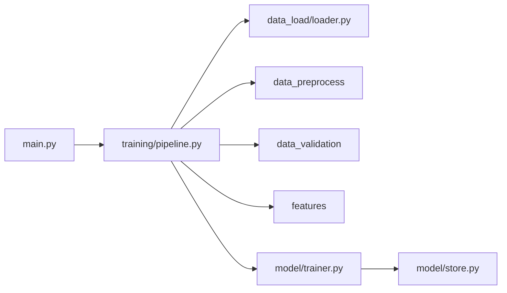
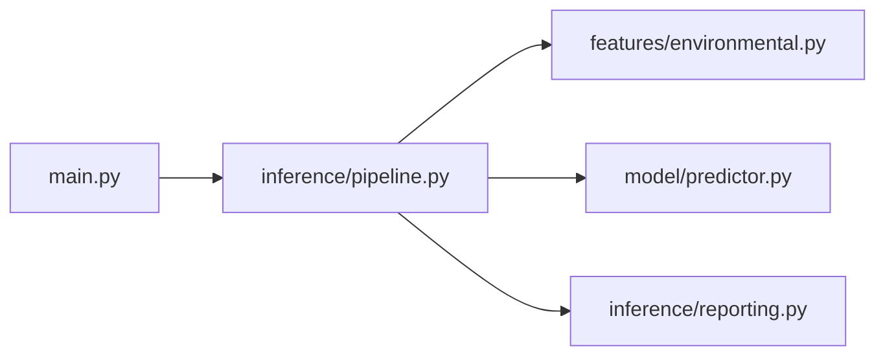

# Huckleberry Habitat Suitability Prediction

<p align="center">
  
</p>

Predict huckleberry (*Vaccinium membranaceum*) habitat suitability from GBIF occurrence records and environmental data (GridMET climate, elevation, soil pH). The pipeline handles ETL, pseudo-absence sampling, model training, and coordinate-based inference with maps and reports.

---

## Quick start

**Prerequisites:** Python 3.9+, [Conda](https://docs.conda.io/) (recommended), [Ollama](https://ollama.ai/) (geocoding fallback)

```bash
git clone <repository-url>
cd Capstone-Microsoft
conda env create -f environment.yml
conda activate Capstone-Microsoft
```

Verify with a fast training run on the small GBIF sample:

```bash
python -m src.main train --sample
```

**Train** from the cached model-ready snapshot (skips the ~5-hour ETL):

```bash
python -m src.main train --dataset hb
```

**Infer** at one or more coordinates (opens `outputs/maps/prediction_map.html` in a browser):

```bash
python -m src.main infer --coordinates 44.5 -116.5 --gridmet-date 2020-07-15
```

Use a specific trained model:

```bash
python -m src.main infer --coordinates 44.5 -116.5 --model models/your_model.joblib
```

---

<details>
<summary><strong>Installation (detailed)</strong></summary>

### Python environment

**Conda (recommended)**

```bash
conda env create -f environment.yml
conda activate Capstone-Microsoft
```

**pip**

```bash
python -m venv venv
# Windows: venv\Scripts\activate
# macOS/Linux: source venv/bin/activate
pip install -r requirements.txt
```

### Ollama (geocoding fallback)

```bash
# Windows
winget install Ollama.Ollama

# macOS
brew install ollama

# Linux
curl -fsSL https://ollama.ai/install.sh | sh
```

</details>

<details>
<summary><strong>Data layout</strong></summary>

### Active directories

| Path | Purpose |
|------|---------|
| `data/raw/occurrence.txt` | Full GBIF download — input for `train` |
| `data/raw/occurrence_sample.txt` | Small subset (~15 records) — `train --sample` |
| `data/processed/huckleberry_processed.csv` | Cleaned records before environmental enrichment |
| `data/enriched/huckleberry_enriched.csv` | Full training dataset with all features |
| `data/snapshots/` | Cached full datasets from the notebook era |
| `data/resources/manual_geocodes.json` | Curated locality → coordinate lookups |

### Snapshots

Produced by `docs/notebooks/Huckleberry.ipynb` so you can skip re-running expensive enrichment:

| File | Description |
|------|-------------|
| `snapshots/HB_PSEUDO_clean_elevation_soil.csv` | Complete enriched dataset (occurrences + pseudo-absences) |
| `snapshots/HB.csv` | Model-ready subset — used to train the current model (v13) |

Relationship: `HB_PSEUDO_*` → drop nulls, parse dates → `HB.csv`.

### Training presets (`--dataset`)

| Preset | File |
|--------|------|
| `hb` | `snapshots/HB.csv` — **recommended** |
| `hb_full` | `snapshots/HB_PSEUDO_clean_elevation_soil.csv` |

Or pass any path: `python -m src.main train --dataset path/to/file.csv`

`--dataset` and `--sample` are mutually exclusive.

### Archive

Notebook intermediates live in `archive/data/notebook/`. Not used by `src/`.

</details>

<details>
<summary><strong>Training</strong></summary>

```bash
# Full ETL from raw GBIF (several hours)
python -m src.main train

# Quick smoke test (~15 records)
python -m src.main train --sample

# Skip ETL — train from snapshot
python -m src.main train --dataset hb
python -m src.main train --dataset data/snapshots/HB.csv

# Model type (default: random_forest)
python -m src.main train --dataset hb --model-type random_forest
python -m src.main train --dataset hb --model-type ensemble
```

**What happens**

1. Load GBIF data (or CSV when `--dataset` is set)
2. Clean, filter, geocode
3. Generate pseudo-absences (training from raw data only)
4. Extract GridMET, elevation, and soil features
5. Train and register model in `models/registry.json`
6. Write processed/enriched CSVs and feature-importance reports

**Model types**

| Type | Notes |
|------|-------|
| `random_forest` | Default; fast and interpretable |
| `ensemble` | XGBoost + BernoulliNB stacking (requires TPOT) |

</details>

<details>
<summary><strong>Inference</strong></summary>

```bash
# Multiple coordinates (lat lon pairs)
python -m src.main infer --coordinates 44.5 -116.5 44.6 -116.4

# Season / climate date for GridMET
python -m src.main infer --coordinates 44.5 -116.5 --gridmet-date 2020-07-15

# Custom model and confidence threshold
python -m src.main infer --coordinates 44.5 -116.5 \
  --model models/huckleberry_model_v13.joblib \
  --confidence-threshold 0.6

# Skip map generation
python -m src.main infer --coordinates 44.5 -116.5 --no-map
```

**Defaults**

- Model: registry `current` → `huckleberry_model_v13` (override with `--model`)
- GridMET date: latest available (override with `--gridmet-date YYYY-MM-DD`, range ~1979–2020)
- Confidence threshold: `0.8` — counts as “suitable habitat” in summary stats; map shows **all** points color-coded (green / orange / red)

**What happens**

1. Validate coordinates
2. Fetch GridMET, elevation, and soil for each point
3. Score with `HabitatPredictor`
4. Write CSV, optional HTML map, JSON summary, and confidence plot

</details>

<details>
<summary><strong>Outputs</strong></summary>

| Location | Contents |
|----------|----------|
| `outputs/predictions/` | `inference_predictions.csv`, timestamped `top_predictions_*.csv` |
| `outputs/maps/` | `prediction_map.html` — interactive Folium map |
| `outputs/summaries/` | `inference_summary_*.json`, `confidence_plot_*.png` |
| `outputs/feature_importance/` | CSV + plot per training run |
| `data/processed/`, `data/enriched/` | Pipeline CSV outputs |
| `models/` | `.joblib` artifacts + `registry.json` |
| `logs/` | `pipeline.log` |

</details>

<details>
<summary><strong>Architecture</strong></summary>

`src/main.py` is a thin CLI — it parses arguments and dispatches to orchestrators.

```
src/
  main.py              CLI
  config/              Settings and presets
  data_load/           I/O only (CSV, GBIF)
  data_preprocess/     Cleaning, filtering, geocoding
  data_validation/     Schema checks at pipeline boundaries
  features/            Environmental, temporal, pseudo-absence sampling
  training/            Training orchestration
  inference/           Coordinate inference + maps/reports
  model/               Registry, training, version store, predictor
  evaluation/          Feature importance
  utils/               Logging, data versioning
```

### Training flow



### Inference flow



### Model package

| Module | Role |
|--------|------|
| `model/registry.py` | `@register("name")` + `create_model()` |
| `model/implementations/` | Algorithm classes (`fit`, `predict_proba`) |
| `model/features.py` | Feature matrix column selection |
| `model/trainer.py` | Training entry point |
| `model/store.py` | `registry.json` + versioned `.joblib` files |
| `model/predictor.py` | Load models + `HabitatPredictor` scoring |

Loading and scoring live in `model/`, not `inference/`. Inference orchestrates coordinates → environmental features → predictor.

| Question | Module |
|----------|--------|
| Given features, what's the score? | `model/predictor.py` |
| Given lat/lon, what's the score? | `inference/pipeline.py` |

### Adding a new model type

1. Implement `src/model/implementations/your_model.py` with `@register("your_name")`
2. Import it in `src/model/implementations/__init__.py`
3. Train with `--model-type your_name`

> `docs/` holds research artifacts (notebooks, notes, meeting notes). `archive/` holds legacy scripts and notebook-era data. The production pipeline in `src/` is independent.

</details>

<details>
<summary><strong>Repository layout</strong></summary>

```
Capstone-Microsoft/
├── data/                   # Raw, processed, enriched, and snapshot datasets
├── docs/                   # Research and project documentation
│   ├── notebooks/          # Pre-pipeline exploration (e.g. Huckleberry.ipynb)
│   ├── notes/              # Planning and exploration write-ups
│   ├── meeting_notes/
│   ├── references/
│   ├── legacy/             # Archived July 2025 runs (models + inference outputs)
│   └── assets/             # README images and GIFs
├── models/                 # Trained .joblib files and registry.json
├── outputs/                # Predictions, maps, summaries, feature importance
├── src/                    # Production pipeline (CLI, training, inference)
├── archive/                # Legacy scripts and notebook-era intermediates
├── logs/
└── tests/
```

</details>

<details>
<summary><strong>Configuration</strong></summary>

Settings: `src/config/settings.py` and `src/config/environments.py`.

| Mode | Command | Raw input | `n_estimators` |
|------|---------|-----------|----------------|
| Full | `train` | `data/raw/occurrence.txt` | 200 |
| Sample | `train --sample` | `data/raw/occurrence_sample.txt` | 50 |

All runs write to the same paths: `data/processed/huckleberry_processed.csv` and `data/enriched/huckleberry_enriched.csv`.

**Pseudo-absences:** ratio 3:1, 5 km buffer from real occurrences.

**Environmental features:** 8 GridMET variables, elevation (Open-Elevation), soil pH (SoilGrids), temporal/season columns.

</details>

<details>
<summary><strong>Testing</strong></summary>

```bash
pytest tests/
pytest tests/test_basic.py
pytest --cov=src tests/
```

</details>

<details>
<summary><strong>Performance & timing</strong></summary>

| Stage | Typical time |
|-------|----------------|
| Full ETL + enrichment | ~5+ hours |
| Train from `hb` snapshot | ~5–15 min |
| Inference per coordinate | ~30–60 s |
| Model accuracy (snapshot) | ~85–95% |

Long GridMET runs can fail if Planetary Computer signed URLs expire mid-run — prefer `--dataset hb` for training unless you need a fresh ETL.

</details>

<details>
<summary><strong>Troubleshooting</strong></summary>

| Issue | What to try |
|-------|-------------|
| GridMET / Planetary Computer errors | Check network; reinstall `pystac-client` and `planetary-computer`; use `--dataset hb` to skip ETL |
| Low inference confidence | Try a different `--gridmet-date`; check elevation API (504s fill elevation with 0) |
| Model not found | Pass `--model path/to/file.joblib` or check `models/registry.json` |
| Geocoding failures | See `data/resources/manual_geocodes.json` |
| Memory pressure | Use `train --sample` or `--dataset hb` |

Logs: `logs/pipeline.log`

</details>

<details>
<summary><strong>Legacy runs (July 2025)</strong></summary>

The first successful capstone demos (v9/v10 dev models, inference on 17 coordinates, confidence plots) are archived under [`docs/legacy/`](docs/legacy/README.md) — not used by the active pipeline.

Includes the notebook-era `random_forest_improved.joblib`, feature-importance CSVs, top predictions, and inference summaries from 2025-07-05.

</details>

<details>
<summary><strong>Data sources & acknowledgments</strong></summary>

- [GBIF — *Vaccinium membranaceum*](https://www.gbif.org/species/9060377)
- [Microsoft Planetary Computer — GridMET](https://planetarycomputer.microsoft.com/dataset/gridmet)
- [Open-Elevation API](https://api.open-elevation.com/)
- [SoilGrids](https://www.isric.org/explore/soilgrids)

</details>
